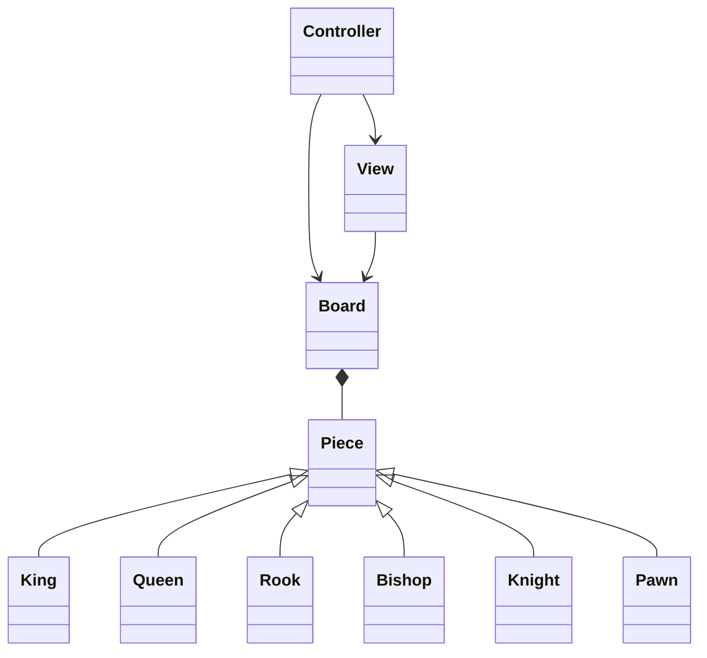

# Big DEEP Blue Architecture

Big DEEP Blue separates game state, graphical representation,
and user interaction into separate components.

## High-Level Architecture

## Board

The `Board` class is responsible for maintaining the current
state of the chess game.

...